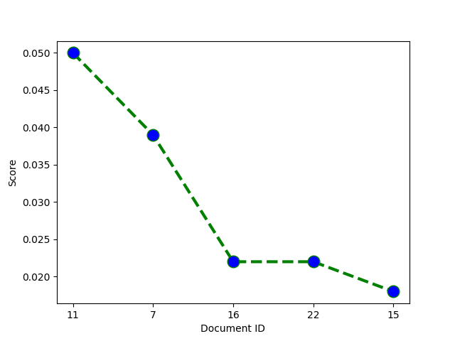

1. To run and open GUI CODE, the COMMANDS that you need to run in ANACONDA PROMPT are :
   code TFIDF_GUIcode.py (to open code in VScode)
   and
   python TFIDF_GUIcode.py (to run the code)

2. You can run code file with '.ipynb' extension easily in the jupyter notebook (it doesn't have GUI)

---

### Data Set

Data Set is a collection of Trump Speeches (File name: Trump Speeches 56 files) for implementing inverted index and positional index. A single file contains a single speech from All of Trump's Speeches from June 2015 to November 9, 2016.

Total unstructured text Documents: 52

### Visualization of Results

